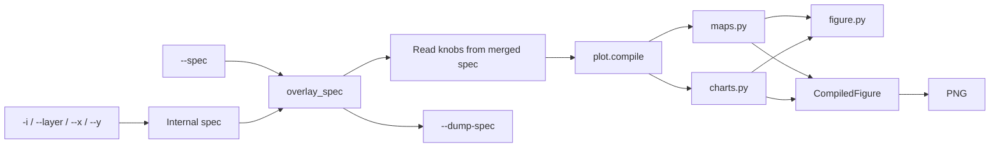

# Plotting skills

Figure stack. Agent how-tos live in each skill’s
[`SKILL.md`](../skills/plot/SKILL.md); this page is the design of the
compiler.

## How the stack works



- **Data** comes only from decorator-opened Zarrs (`-i`, `--layer`,
  `--x`/`--y`, `--obs`/`--forecast`/`--verify`, or paths listed in
  `--spec` when no file flag was passed). The formatting spec must not
  open files itself.
- **Layout** is JSON with **one home per knob** (see the table below). An
  unknown key is an error listing every valid key at that level, never a
  silent no-op — there is no back-compat redirect table, so run
  `--dump-spec -` on your inputs with no `--spec` to see the current schema
  instead of guessing a key. A default run writes only the PNG. The skill
  builds an internal spec from
  the opened files, then deep-merges `--spec` onto it. User values win.
  `--dump-spec` writes that merged spec and skips the PNG (`-o` is not
  required). There is no `--patch` and no `*.plot.json` sidecar.
- **Files on the command line, parameters in `--spec`.** `-i`, `--layer
  KIND:PATH`, `--x`, and `--y` name the datasets. Kind, variable, titles,
  colormap, bbox, and the rest of the old flag set are spec keys. Passing
  one of those flags errors and names the JSON path. `inputs[]` merges by
  id, `traces[]` by `input` (else id), `layers[]` by id (else index),
  `subplots[]` by `(row, col)` (else index), so a partial object does not
  wipe the figure.
- **One map renderer.** `heatmap`, `contour`, `quiver` and `--layer` all
  compile through `plot.maps`: a single-input kind is just a one-layer
  figure. A heatmap kind and `--layer heatmap:<path>` render the same
  picture. Several heatmap traces are separate panels, one per dataset,
  each on that Zarr's lat/lon. `--layer` still stacks every input on one
  axes. Overlays (coastlines, borders, filled lakes, admin-1) pick a
  Natural Earth resolution from the map span and skip a layer with a
  warning if it cannot be fetched.
- **Recipes stay Python** (verify grid, mediogram boxes). There is no
  generic mosaic DSL. Those skills still call `maps.compile_grid` /
  `charts.compile_lines` / `charts.compile_mediogram` and go through
  `export`.
- **Theme** is seaborn (`weather_skills` / `colorblind`) then optional
  `theme.rc`. The renderer applies its own chart theme, so a caller cannot
  hand a map the line-chart style. PNG via matplotlib Agg.

Python surface (`import weather_skills_core.plot` does not load matplotlib):

```python
from weather_skills_core.plot import PlotSpec, compile, dump_spec, export, load_spec

compiled = compile(spec, datasets)
export(compiled, output, datasets=datasets)
```

`export()` prints two stdout lines after the PNG is written: `plot hash:` (sha256
of RGB pixels) and `data: not null (…) ` or `data: NULL (…)`. Compare hashes
across runs to see whether the figure changed. `NULL` means every plotted
variable is all-NaN — `inspect-zarr` the input. `--dump-spec -` skips the PNG
and this report.

## Skill catalog

| Skill | Job | Typical inputs | Layout |
| --- | --- | --- | --- |
| [`plot`](../skills/plot/SKILL.md) | One dataset, several heatmap panels, or stacked `--layer` maps | `-i`, paths in `--spec`, or `--layer KIND:PATH` | heatmap / contour / timeseries / xy / windrose / quiver |
| [`plot-timeseries`](../skills/plot-timeseries/SKILL.md) | Several 1D series | repeatable `-i` | overlay or `layout.facet.per_trace`; `traces[].along` spaghetti |
| [`plot-verify`](../skills/plot-verify/SKILL.md) | Lead-week obs / fc / metric | `--obs` + `--forecast` + verify Zarrs | 2-row metric grid; data must already be one time |
| [`plot-mediogram`](../skills/plot-mediogram/SKILL.md) | Ensemble vs m-climate at a point | forecast + m-climate Zarrs + `geo.lat` / `geo.lon` | grouped boxplots + mean line |

**Decision rule.** `plot-timeseries` is many 1D traces. `plot-verify` and
`plot-mediogram` are specialized recipes. Inside `plot`, pick the layout
from the table. Different lat/lon spacing is not a reason to coarsen.

| Goal | Call |
| --- | --- |
| Two maps in one PNG, each on its own grid (0.05° beside 1.5°) | Repeat `-i`, or two `inputs` and two `traces` with `kind: heatmap`. `layout.facet` is `{rows: 1, columns: 2}`. `subplot_titles` names the panels (`layout.facet.titles` is stored there). Figure `vmin` / `vmax` are shared. `inputs[].vmin`, `inputs[].vmax`, `inputs[].colormap`, and `inputs[].cbar_label` apply to that panel only. Each trace must already be a single map. |
| Same datasets drawn on top of each other | `--layer`. One axes. `layers[].panel` is not a key. |
| Several times or steps of one dataset | One heatmap trace. `layout.facet.rows` / `columns` tile those slices. |

A shared lat/lon grid is required only by `difference` and `verify`, which
subtract cell by cell. Do not `coarsen` or `downscale` solely to plot.

Precip figures still expect **totals (`mm`)**, not rates:
`aggregate-temporal` then `convert-to-totals` first.

Onset dates from `indicator --detect first` are ordinary `plot` maps. Do not
average `number` first; use `summarize-dim --dim number --method mean` on
`indicator_doy` for a mean onset day-of-year.

## Shared JSON spec

Every knob has exactly one home. `normalize_spec` in `plot/spec.py` validates
against this table and rejects anything else, listing the valid keys at that
level. There is no legacy-key redirect table — an old or misplaced key is
just "not a known key," so use this table (or `--dump-spec -`) as the
reference. Spec version is `2`.

| Where | Keys |
| --- | --- |
| top level | `version`, `skill`, `inputs`, `traces`, `layers`, `subplots`, `axes`, `annotations`, `shapes`, `title`, `subplot_titles`, `xlabel`, `ylabel`, `cbar_label`, `legend`, `vmin`, `vmax` |
| `layout` | `figsize`, `autosize`, `dpi`, `facecolor`, `colorbar`, `suptitle`, `shared_colorscale`, `bar_mode`, `facet` |
| `layout.facet` | `rows`, `columns`, `max_columns`, `n_panels`, `wspace`, `hspace`, `per_trace` (plot-timeseries: one stacked row per input) |
| `theme` | `template`, `colormap` (name, comma list, or `{name, colors, bounds, under, over, cmap}`), `fontsize`, `rc` |
| `layout.colorbar` | `len`/`shrink`, `thickness`, `pad` (strip gap), `labelpad` / `labelsize` (colorbar label), `ticksize` (colorbar ticks), `location`, `orientation`, `extend`, `ticks`, `labels`, plus `drawedges` / `spacing` / `format` |
| `layout.suptitle` | `y` — figure-title height as a figure fraction (default 0.98; larger moves `title` up). Panel titles stay on `theme.rc.axes.titlepad`. A string at `layout.title` is still the title text and belongs on top-level `title` |
| `geo` | `extent`, `bbox`, `cities`, `mask_geojson`, `draw_boxes`, `overlays`, `lat`, `lon` |
| `inputs[]` | `id`, `path`, `variable`, `index`, `label`, `colormap`, `vmin`, `vmax`, `cbar_label`, `role` |
| `subplots[]` | One grid cell. `row` / `col` are 1-based (set both on every cell, or neither and the cells fill in order). `title`, `vmin`, `vmax`, `colormap`, `cbar_label`, `variable`, `index` style that cell. `layers` stack on the cell and use the same keys as `layers[]`; a layer key wins over the cell. Merges onto an existing grid by `(row, col)` (else index) — a partial `--spec` patch to one cell does not replace the grid. |
| `traces[]` | `kind`, `input`, `mark`, `x`, `y`, `path`, `along`, `along_color`, `reduce`, `align`, `band`, `pair_on`, `time_dim`, `u_variable`, `v_variable`, `x_variable`, `y_variable`, `metric`, `leads`, plus the artist blocks |
| `traces[]` artist blocks | `line`, `mesh`, `contour`, `scatter`, `bar`, `quiver`, `windrose`, `fill`, `box`, `mediogram` |
| `layers[]` | `id` (default `a`, `b`, …), `kind`, `path`, `input`, `raw`, scale knobs (`variable`, `colormap`, `vmin`, `vmax`, `index`, `u_variable`, `v_variable`), artist blocks (`mesh`, `quiver`, `scatter`, `contour`, …). Quiver stride and arrow length are `quiver.step` and `quiver.scale` on the trace or the layer. A leftover `options` bag from older dumps is still accepted |

Where a knob lives:

| Knob | Spec |
| --- | --- |
| kind | `traces[0].kind` (`heatmap`, `contour`, `quiver`, `layer`, `timeseries`, `xy`, `windrose`, `grid`, `mediogram`) |
| mark | `traces[].mark` (`line` or `bar`) |
| bar mode | `layout.bar_mode` (`grouped` default, `stacked`, `overlay`) |
| theme | `theme.template` (`weather_skills` / `colorblind`) |
| theme file | `--theme-file` (not a spec key) |
| panel spacing | `layout.facet.wspace` / `layout.facet.hspace` |

A dumped spec from an older version of this tool (`style`, `traces[].type`,
`traces[].style`, …) is rejected outright, listing the current valid keys.
There is no back-compat rewrite or redirect table — re-check this table
(or run `--dump-spec -` on your inputs) rather than reusing an old dump.

Key details:

- **`traces[].along_color`**: with `along`, `same` (default) paints every member one color; `cycle` gives each along-value its own color and legend entry. `cycle` cannot combine with `band`.
- **`axes`** applies after the data are drawn. A dump includes only the keys you set; the catalog is `AXES_TEMPLATE` in `plot/figure.py`.
- **`layout.facet.wspace` / `hspace`**: inter-panel gap as a fraction of panel size. Figures are built with seaborn `FacetGrid`, which passes the gap through `gridspec_kws`. Line charts then run `tight_layout`, and the gap is applied again so the requested fraction survives. Map and wind-rose figures skip that second `tight_layout`: Cartopy and polar axes ignore it, and it pulls the colorbar onto the axes. Horizontal colorbar labels that still overlap are rotated 45°; no tick is dropped. Export does not crop with `bbox_inches="tight"`. Because that second pass is skipped, a multi-row map grid (`layout.facet.rows > 1`) does **not** get automatic room for panel titles between rows — leaving `hspace` unset crushes rows together. Set it explicitly (`0.3`–`0.4` is a reasonable start; more for wrapped titles) whenever a map grid has more than one row.
- **`layout.bar_mode`**: `grouped` (default), `stacked`, or `overlay`. Per-trace `traces[].bar.mode` is an alias when `layout.bar_mode` is unset.
- **`theme.colormap`**: a matplotlib name, a comma-separated color list, or `{colors, bounds, under, over}`. Named palettes also resolve from `--theme-file`. When plotting rainfall anomalies, omit the name so the default nested millimetre windows apply.
- **`cbar_label`**: the quantity on the color scale, not a date. Valid time belongs on `title` / `subplot_titles`.
- **`layout.colorbar`**: set the object in `--spec`. `labelpad`, `labelsize`, and `ticksize` are colorbar-only. `pad` is the gap between the maps and the strip. `ticks` and `labels` need the same count.
- **`layout.suptitle.y`**: figure-title height as a figure fraction (default 0.98). `--spec '{"layout": {"suptitle": {"y": 1.04}}}'`. A title string belongs on top-level `title`.
- **`theme.fontsize`**: writes the title, label, tick, and legend sizes. Stays 16 when absent.
- **Layer options** live on `layers[]` (snake_case). `--layer` is `KIND:PATH` only. A partial `layers[]` merges by id and does not replace the list.
- **No `patch` key.** Merge edits into `--spec`. The compiler does not read a `patch` object.

`--dump-spec` writes the merged spec and skips the PNG. Pass that JSON back as `--spec` to replay it; file flags still choose the datasets when they are present.

Neither `plot` nor `plot-timeseries` averages a leftover dim. Set `traces[].reduce` or `traces[].along`.

## Suggested evaluation path

1. One heatmap: `plot -i … -o out.png --spec '{"title":"Precip","inputs":[{"variable":"precip"}]}'`. Re-run with `--dump-spec -` to see the merge.
2. Ensemble spaghetti: `plot-timeseries -i … -o out.png --spec '{"traces":[{"along":"number","band":[10,90]}]}'`.
3. A mediogram, a windrose, or a `--layer` map: change ticks or legend in `--spec` without repeating the file flags.
