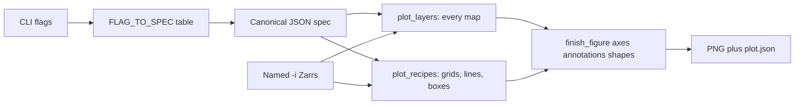

# Plotting skills

Figure stack on `plot-refactor`. Agent how-tos live in each skill’s
[`SKILL.md`](../skills/plot/SKILL.md); this page is for judging the *design*.

## How the stack works

- **Data** comes only from decorator-opened Zarrs (`-i`, `--layer`,
  `--obs`/`--forecast`, or paths listed in `--spec`). The formatting spec
  must not open files itself.
- **Layout** is JSON with **one home per knob** (see the table below). An
  unknown key is an error naming the canonical path, never a silent no-op.
  A default run writes `<stem>.plot.json` holding only the values that were
  actually resolved; edit it and replot with `--spec`.
- **One flag-to-spec bridge.** `FLAG_TO_SPEC` in `plot_spec.py` is the only
  place that knows how a CLI flag lands in the spec. Skills read values back
  through `resolve_flags(spec, **cli)`, which is the single precedence rule:
  a set CLI value wins, otherwise the spec's value is used.
- **One map renderer.** `heatmap`, `contour`, `quiver` and `--layer` all
  compile through `plot_layers`: a single-input style is just a one-layer
  figure. `plot --style heatmap x.zarr` and `plot --layer heatmap:x.zarr`
  render pixel-identical output. Overlays (coastlines, borders, filled lakes,
  admin-1) come from `plot_geo`, which picks a Natural Earth resolution from
  the map span and skips a layer with a warning if it cannot be fetched.
- **Recipes stay Python** (compare grid, verify grid, mediogram boxes).
  There is no generic mosaic DSL.
- **Chrome** is seaborn (`weather_skills` / `colorblind`) then optional
  `style.rc`. The renderer applies its own chart theme, so a caller cannot
  hand a map the line-chart style. PNG via matplotlib Agg.

## Skill catalog

| Skill | Job | Typical inputs | Layout |
| --- | --- | --- | --- |
| [`plot`](../skills/plot/SKILL.md) | One dataset (or stacked `--layer` maps) | `-i` or `--layer KIND:PATH` | heatmap / contour / timeseries / xy / windrose / quiver |
| [`plot-timeseries`](../skills/plot-timeseries/SKILL.md) | Several 1D series | repeatable `-i` | overlay or `--subplots`; `--along` spaghetti; `--band`; `--trace` styling |
| [`plot-compare`](../skills/plot-compare/SKILL.md) | Exactly two datasets, two rows | `-i` twice | union of times as columns; station vs grid as separate rows |
| [`plot-compare-forecasts`](../skills/plot-compare-forecasts/SKILL.md) | N grids vs shared valid times | `-i` N times | one row per input; blank `n/a` if a time is missing |
| [`plot-verify`](../skills/plot-verify/SKILL.md) | Lead-week obs / fc / metric | `--obs` + `--forecast` + verify Zarrs | 2-row metric grid; data must already be one time |
| [`plot-mediogram`](../skills/plot-mediogram/SKILL.md) | Ensemble vs m-climate at a point | forecast + m-climate Zarrs + lat/lon | grouped boxplots + mean line |

**Decision rule:** `plot` = one product or overlays on the same axes.
`plot-timeseries` = many traces. `plot-compare` = two products, two rows.
`plot-compare-forecasts` = N products, aligned times. `plot-verify` /
`plot-mediogram` = specialized recipes.

Precip figures still expect **totals (`mm`)**, not rates:
`aggregate-temporal` then `convert-to-totals` first.

Onset dates from `indicator --detect first` are ordinary `plot` maps. Do not
average `number` first; use `summarize-dim --dim number --method mean` on
`indicator_doy` for a mean onset day-of-year.

## Shared JSON spec

Every knob has exactly one home. `normalize_spec` in `plot_spec.py` validates
against this table and rejects anything else, naming the canonical path for a
key that used to be readable somewhere else.

| Where | Keys |
| --- | --- |
| top level | `version`, `skill`, `inputs`, `traces`, `layers`, `axes`, `annotations`, `shapes`, `title`, `subplot_titles`, `xlabel`, `ylabel`, `cbar_label`, `legend`, `vmin`, `vmax` |
| `layout` | `figsize`, `autosize`, `dpi`, `facecolor`, `colorbar`, `shared_colorscale`, `subplots`, `facet` |
| `layout.facet` | `rows`, `columns`, `max_columns`, `n_panels` |
| `style` | `template`, `colormap`, `fontsize`, `rc` |
| `geo` | `extent`, `bbox`, `cities`, `mask_geojson`, `draw_boxes`, `overlays`, `lat`, `lon` |
| `inputs[]` | `id`, `path`, `variable`, `index`, `label`, `colormap`, `role` |
| `traces[]` | `type`, `input`, `style`, `x`, `y`, `path`, `along`, `reduce`, `align`, `band`, `pair_on`, `u_variable`, `v_variable`, `x_variable`, `y_variable`, `metric`, `leads`, plus the artist blocks |
| `traces[]` artist blocks | `line`, `mesh`, `contour`, `scatter`, `bar`, `quiver`, `windrose`, `fill`, `box`, `mediogram` |
| `layers[]` | `kind`, `path`, `options`, `input`, `raw` |

Key details:

- **`axes`** applies **after** the data are drawn: `xscale`/`yscale`,
  `xlim`/`ylim`, labels, `xticks`/`yticks` (list or `{values, labels}`),
  `tick_params`, locators (`auto`/`log`/`maxn`/`null`/`multiple`), formatters
  (`scalar`/`log`/`percent`/`date`/`format`/`dayofyear`), spines, grid,
  legend, `twinx`/`twiny`. A sidecar dumps only the keys you set; the full
  editable set is `AXES_TEMPLATE` in `plot_mpl.py`.
- **`annotations` / `shapes`**: text/arrows; rect, h/v lines and spans, circle.
- **`style.rc`**: matplotlib rcParams after seaborn; backend keys rejected.
- **No `patch` key.** `--patch` is still a CLI convenience — it deep-merges
  into the spec before compile — but the compiler never reads a `patch`
  object, so there is one place a title or annotation can live.

Dump → edit → `--spec out.plot.json` is the intended agent loop. CLI flags
overlay the spec. Provenance still chains from the Zarrs.

## What is still not uniform

- **Recipe internals still own some ticks until spec overrides** (mediogram
  category labels, heatmap lon/lat ticks, date formatters). Spec wins
  because `finish_figure` runs last.
- **Closed allowlists**, not the full matplotlib Artist API. That is
  deliberate (safe JSON), not a complete `ax.*` mirror.
- **Two CLIs for 1D**, but they now agree on the data question: neither
  `plot --style timeseries` nor `plot-timeseries` will average a leftover dim
  for you — pass `--reduce` per dim or `--along` to fan it out.
  `plot-timeseries` remains the one for several inputs, `--subplots`,
  `--band`, and `--trace` styling.
- **Core vs skill pin**: scripts depend on a matching `weather-skills-core`
  checkout. Evaluating locally may need `PYTHONPATH` to that core.

## Suggested evaluation path

1. One heatmap: `plot -i … -o out.png` → read `out.plot.json` → change
   `axes.spines` / `layout.colorbar` → `--spec` replot.
2. Analog-year spaghetti: `plot-timeseries --along` / `--band` /
   `--align-day-of-year` → edit `axes.xticks` and `line`.
3. Two-row compare, a mediogram, and a windrose or `--layer` map: confirm
   the sidecar contains the same `axes` keys and that `--spec` changes
   ticks/legend without re-passing `--style` / `--layer`.
