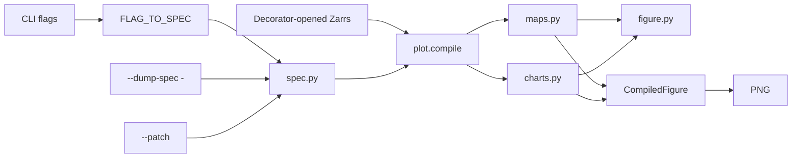

# Plotting skills

Figure stack. Agent how-tos live in each skill’s
[`SKILL.md`](../skills/plot/SKILL.md); this page is the design of the
compiler.

## How the stack works



- **Data** comes only from decorator-opened Zarrs (`-i`, `--layer`,
  `--obs`/`--forecast`, or paths listed in `--spec`). The formatting spec
  must not open files itself.
- **Layout** is JSON with **one home per knob** (see the table below). An
  unknown key is an error naming the canonical path, never a silent no-op.
  A default run writes only the PNG. `--dump-spec` dumps the assembled spec
  as JSON and skips drawing a PNG (`-o` is not required). `--dump-spec -`
  prints to stdout when you need to inspect knobs; `--patch` submits edits.
  There is no `*.plot.json` sidecar.
- **One flag-to-spec bridge.** First runs use CLI flags (`--title`,
  `--variable`, `--mask-geojson`, `--figsize`, `--kind`, …). `--spec` is
  an optional full JSON object (replay a dump, or pack many knobs) — not a
  replacement for those flags. `FLAG_TO_SPEC` in `plot/spec.py` is the only
  place that knows how a CLI flag lands in the spec. Skills read values
  back through `resolve_flags(spec, **cli)`, which is the single
  precedence rule: a set CLI value wins, otherwise the spec's value is used.
- **One map renderer.** `heatmap`, `contour`, `quiver` and `--layer` all
  compile through `plot.maps`: a single-input kind is just a one-layer
  figure. `plot --kind heatmap x.zarr` and `plot --layer heatmap:x.zarr`
  render pixel-identical output. Overlays (coastlines, borders, filled lakes,
  admin-1) pick a Natural Earth resolution from the map span and skip a layer
  with a warning if it cannot be fetched.
- **Recipes stay Python** (compare grid, verify grid, mediogram boxes).
  There is no generic mosaic DSL. Those skills still call
  `maps.compile_grid` / `charts.compile_lines` / `charts.compile_mediogram`
  and go through `export`.
- **Theme** is seaborn (`weather_skills` / `colorblind`) then optional
  `theme.rc`. The renderer applies its own chart theme, so a caller cannot
  hand a map the line-chart style. PNG via matplotlib Agg.

Python surface (`import weather_skills_core.plot` does not load matplotlib):

```python
from weather_skills_core.plot import PlotSpec, compile, dump_spec, export, load_spec

compiled = compile(spec, datasets)
export(compiled, output, datasets=datasets)
```

## Skill catalog

| Skill | Job | Typical inputs | Layout |
| --- | --- | --- | --- |
| [`plot`](../skills/plot/SKILL.md) | One dataset (or stacked `--layer` maps) | `-i` or `--layer KIND:PATH` | heatmap / contour / timeseries / xy / windrose / quiver |
| [`plot-timeseries`](../skills/plot-timeseries/SKILL.md) | Several 1D series | repeatable `-i` | overlay or `--subplots`; `--along` spaghetti; `--band`; `--trace` styling |
| [`plot-compare`](../skills/plot-compare/SKILL.md) | Exactly two datasets, two rows | `-i` twice | union of times as columns; station vs grid as separate rows |
| [`plot-compare-forecasts`](../skills/plot-compare-forecasts/SKILL.md) | N grids vs shared valid times | `-i` N times | one row per input; blank `n/a` if a time is missing |
| [`plot-verify`](../skills/plot-verify/SKILL.md) | Lead-week obs / fc / metric | `--obs` + `--forecast` + verify Zarrs | 2-row metric grid; data must already be one time |
| [`plot-mediogram`](../skills/plot-mediogram/SKILL.md) | Ensemble vs m-climate at a point | forecast + m-climate Zarrs + lat/lon | grouped boxplots + mean line |

**Decision rule:** `plot` = one product or overlays on the same axes.
`plot-timeseries` = many traces. `plot-compare` = two products, two rows.
`plot-compare-forecasts` = N products, aligned times. `plot-verify` /
`plot-mediogram` = specialized recipes.

Precip figures still expect **totals (`mm`)**, not rates:
`aggregate-temporal` then `convert-to-totals` first.

Onset dates from `indicator --detect first` are ordinary `plot` maps. Do not
average `number` first; use `summarize-dim --dim number --method mean` on
`indicator_doy` for a mean onset day-of-year.

## Shared JSON spec

Every knob has exactly one home. `normalize_spec` in `plot/spec.py` validates
against this table and rejects anything else, naming the canonical path for a
key that used to be readable somewhere else. Spec version is `2`.

| Where | Keys |
| --- | --- |
| top level | `version`, `skill`, `inputs`, `traces`, `layers`, `axes`, `annotations`, `shapes`, `title`, `subplot_titles`, `xlabel`, `ylabel`, `cbar_label`, `legend`, `vmin`, `vmax` |
| `layout` | `figsize`, `autosize`, `dpi`, `facecolor`, `colorbar`, `shared_colorscale`, `subplots`, `bar_mode`, `facet` |
| `layout.facet` | `rows`, `columns`, `max_columns`, `n_panels`, `wspace`, `hspace` |
| `theme` | `template`, `colormap` (name, comma list, or `{name, colors, bounds, under, over, cmap}`), `fontsize`, `rc` |
| `layout.colorbar` | `len`/`shrink`, `thickness`, `extend`, `pad`, `location`, `ticks`, `labels`, plus matplotlib extras |
| `geo` | `extent`, `bbox`, `cities`, `mask_geojson`, `draw_boxes`, `overlays`, `lat`, `lon` |
| `inputs[]` | `id`, `path`, `variable`, `index`, `label`, `colormap`, `role` |
| `traces[]` | `kind`, `input`, `mark`, `x`, `y`, `path`, `along`, `along_color`, `reduce`, `align`, `band`, `pair_on`, `u_variable`, `v_variable`, `x_variable`, `y_variable`, `metric`, `leads`, plus the artist blocks |
| `traces[]` artist blocks | `line`, `mesh`, `contour`, `scatter`, `bar`, `quiver`, `windrose`, `fill`, `box`, `mediogram` |
| `layers[]` | `kind`, `path`, `options`, `input`, `raw` |

CLI and JSON use the same words:

| CLI | Spec |
| --- | --- |
| `plot --kind` | `traces[0].kind` (`heatmap`, `contour`, `quiver`, `layer`, `timeseries`, `xy`, `windrose`, `grid`, `mediogram`) |
| `plot-timeseries --mark` | `traces[].mark` (`line` or `bar`) |
| `plot-timeseries --bar-mode` | `layout.bar_mode` (`grouped` default, `stacked`, `overlay`) |
| `--theme` | `theme.template` (`weather_skills` / `colorblind`) |
| `--theme-file` | user palette registry (not a spec key) |
| `--panel-spacing` | `layout.facet.wspace` / `layout.facet.hspace` (`W` or `W,H`) |

Old dumped-spec keys (`style`, `traces[].type`, `traces[].style`, …) are rejected
with a relocation message. There is no silent rewrite.

Key details:

- **`traces[].along_color`**: with `along`, `same` (default) paints every
  member one color; `cycle` gives each along-value its own color and legend
  entry. CLI: `--along-color`. `cycle` cannot combine with `band`.
- **`axes`** applies **after** the data are drawn: `xscale`/`yscale`,
  `xlim`/`ylim`, labels, `xticks`/`yticks` (list or `{values, labels}`),
  `tick_params`, locators (`auto`/`log`/`maxn`/`null`/`multiple`), formatters
  (`scalar`/`log`/`percent`/`date`/`format`/`dayofyear`), spines, grid,
  legend, `twinx`/`twiny`. A dump includes only the keys you set; the full
  editable catalog is `AXES_TEMPLATE` in `plot/figure.py`.
- **`layout.facet.wspace` / `hspace`**: inter-panel gap as a fraction of
  panel size (matplotlib `GridSpec` semantics). CLI: `--panel-spacing W[,H]`.
  When set, equal-aspect map facets drop compressed packing and reserve the
  gap in the canvas so panels separate with whitespace rather than extra
  geographic extent. `layout.wspace` and `layout.facet.horizontal_spacing`
  relocate to these keys.
- **`layout.bar_mode`**: how bar traces compose on a shared axis:
  `grouped` (default; offset side-by-side), `stacked` (cumulative
  `bottom`), or `overlay` (same x, overlapping). CLI:
  `plot-timeseries --bar-mode`. Per-trace `traces[].bar.mode` is an alias
  when `layout.bar_mode` is unset. Along traces stay lines.
- **`theme.colormap`**: a matplotlib name, a comma-separated color list, or
  `{colors, bounds, under, over}` for a discrete `BoundaryNorm` scale.
  `len(colors)` is `len(bounds) - 1`, or two extra colors packed as under +
  classes + over. Named palettes also resolve from `--theme-file` /
  `colormaps` in the user theme file. Unknown keys in that file are an error.
  When plotting rainfall anomalies, omit the name so the default `ppt_anomaly` /
  `chirps_anom` applies. Matplotlib names are case-insensitive (`RdBu_r`,
  `rdbu_r`, `YlGn`). CLI values that start with `-` need `--flag=value`
  (`--colormap-bounds=-100,100`, `--vmin=-50`).
- **`cbar_label`**: the quantity on the color scale — the variable and
  units (`Total precipitation [mm]`), not a date. Valid time belongs on
  `title` / `subplot_titles` (panel titles already default to calendar
  dates). CLI: `--cbar-label` / per-layer `--label`.
- **`layout.colorbar.ticks` / `labels`**: explicit colorbar ticks. Labels
  need ticks and the same count. CLI: `--colormap-bounds`, `--cbar-ticks`,
  `--cbar-labels`.
- **`annotations` / `shapes`**: text/arrows; rect, h/v lines and spans, circle.
- **`theme.rc`**: matplotlib rcParams after seaborn; backend keys rejected.
- **Layer options** are snake_case (`u_variable`, `quiver_scale`).
- **No `patch` key.** `--patch` is a CLI flag on every figure skill — it
  deep-merges into the spec before CLI overlay — but the compiler never
  reads a `patch` object, so there is one place a title or annotation can
  live.

`--dump-spec` dumps assembled JSON and skips the PNG (`-o` is not required).
`--dump-spec -` (only when needed) then `--patch` is the edit loop, not the
first run. Pass `--title` / `--variable` / `--figsize` (and the rest) as CLI
flags; `--spec` and `--patch` are optional. CLI flags overlay the spec.
Provenance still chains from the Zarrs.

Neither `plot --kind timeseries` nor `plot-timeseries` will average a leftover
dim — pass `--reduce` per dim or `--along` to fan it out.
`plot-timeseries` remains the one for several inputs, `--subplots`,
`--band`, and `--trace` styling.

## Suggested evaluation path

1. One heatmap: `plot -i … -o out.png`. If you need a knob that is not a
   CLI flag, re-run with `--dump-spec -`, then the same CLI plus `--patch`
   (`axes.spines`, `layout.colorbar`, …).
2. Analog-year spaghetti: `plot-timeseries --along` / `--band` /
   `--align-day-of-year` → `--patch` `axes.xticks` and `line`.
3. Two-row compare, a mediogram, and a windrose or `--layer` map: confirm
   `--patch` changes ticks/legend without re-passing `--kind` / `--layer`.
