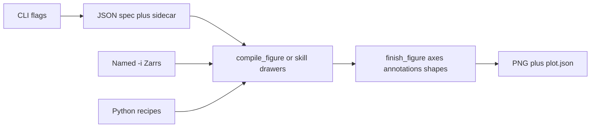

# Plotting skills

Figure stack on `plot-refactor`. Agent how-tos live in each skill’s
[`SKILL.md`](../skills/plot/SKILL.md); this page is for judging the *design*.

## How the stack works

- **Data** comes only from decorator-opened Zarrs (`-i`, `--layer`,
  `--obs`/`--forecast`, or paths listed in `--spec`). The formatting spec
  must not open files itself.
- **Layout** is JSON. A default run writes `<stem>.plot.json`. Edit `axes` /
  annotations / artist kwargs and replot with `--spec`.
- **Recipes stay Python** (compare grid, verify grid, mediogram boxes).
  There is no generic mosaic DSL.
- **Chrome** is seaborn (`weather_skills` / `colorblind`) then optional
  `style.rc`. PNG via matplotlib Agg.

## Skill catalog

| Skill | Job | Typical inputs | Layout |
| --- | --- | --- | --- |
| [`plot`](../skills/plot/SKILL.md) | One dataset (or stacked `--layer` maps) | `-i` or `--layer KIND:PATH` | heatmap / contour / timeseries / xy / windrose / quiver |
| [`plot-timeseries`](../skills/plot-timeseries/SKILL.md) | Several 1D series | repeatable `-i` | overlay or `--subplots`; `--along` spaghetti; `--band`; `--trace` styling |
| [`plot-compare`](../skills/plot-compare/SKILL.md) | Exactly two datasets, two rows | `-i` twice | union of times as columns; station vs grid as separate rows |
| [`plot-compare-forecasts`](../skills/plot-compare-forecasts/SKILL.md) | N grids vs shared valid times | `-i` N times | one row per input; blank `n/a` if a time is missing |
| [`plot-verify`](../skills/plot-verify/SKILL.md) | Lead-week obs / fc / metric | `--obs` + `--forecast` + verify Zarrs | 2-row metric grid; data must already be one time |
| [`plot-mediogram`](../skills/plot-mediogram/SKILL.md) | Ensemble vs m-climate at a point | forecast + m-climate Zarrs + lat/lon | grouped boxplots + mean line |

**Decision rule:** `plot` = one product or overlays on the same axes.
`plot-timeseries` = many traces. `plot-compare` = two products, two rows.
`plot-compare-forecasts` = N products, aligned times. `plot-verify` /
`plot-mediogram` = specialized recipes.

Precip figures still expect **totals (`mm`)**, not rates:
`aggregate-temporal` then `convert-to-totals` first.

Onset dates from `indicator --detect first` are ordinary `plot` maps. Do not
average `number` first; use `summarize-dim --dim number --method mean` on
`indicator_doy` for a mean onset day-of-year.

## Shared JSON spec

Every figure skill that writes a PNG dumps an **`axes`** object (null =
matplotlib default) and applies it **after** the data are drawn.

Main knobs (JSON only; unknown artist keys error; no `eval`):

- **`axes`**: `xscale`/`yscale`, `xlim`/`ylim`, labels, `xticks`/`yticks`
  (list or `{values, labels}`), `tick_params`, locators
  (`auto`/`log`/`maxn`/`null`/`multiple`), formatters
  (`scalar`/`log`/`percent`/`date`/`format`/`dayofyear`), spines, grid,
  legend, `twinx`/`twiny`
- **`annotations` / `shapes`**: text/arrows; rect, h/v lines and spans, circle
- **Artist kwargs**: `line`, `mesh`, `contour`, `scatter`, `bar`, `quiver`,
  `windrose`, `fill` (band), `mediogram`
- **`style.rc`**: matplotlib rcParams after seaborn; backend keys rejected
- **`layout`**: `figsize`, `dpi`, `facecolor`, colorbar
  `len`/`thickness`/`extend`/`pad`/`location`

Dump → edit → `--spec out.plot.json` is the intended agent loop. CLI flags
overlay the spec. Provenance still chains from the Zarrs.

## What is still not uniform

- **Recipe internals still own some ticks until spec overrides** (mediogram
  category labels, heatmap lon/lat ticks, date formatters). Spec wins
  because `finish_figure` runs last.
- **Closed allowlists**, not the full matplotlib Artist API. That is
  deliberate (safe JSON), not a complete `ax.*` mirror.
- **Two CLIs for 1D**: `plot --style timeseries` silently averages leftover
  dims; `plot-timeseries` refuses to average unless `--reduce`/`--along`.
- **Core vs skill pin**: scripts depend on a matching `weather-skills-core`
  checkout. Evaluating locally may need `PYTHONPATH` to that core.

## Suggested evaluation path

1. One heatmap: `plot -i … -o out.png` → read `out.plot.json` → change
   `axes.spines` / `layout.colorbar` → `--spec` replot.
2. Analog-year spaghetti: `plot-timeseries --along` / `--band` /
   `--align-day-of-year` → edit `axes.xticks` and `line`.
3. Two-row compare, a mediogram, and a windrose or `--layer` map: confirm
   the sidecar contains the same `axes` keys and that `--spec` changes
   ticks/legend without re-passing `--style` / `--layer`.
